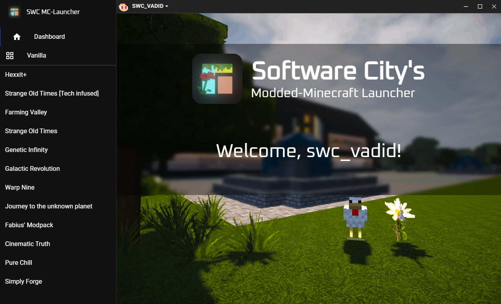
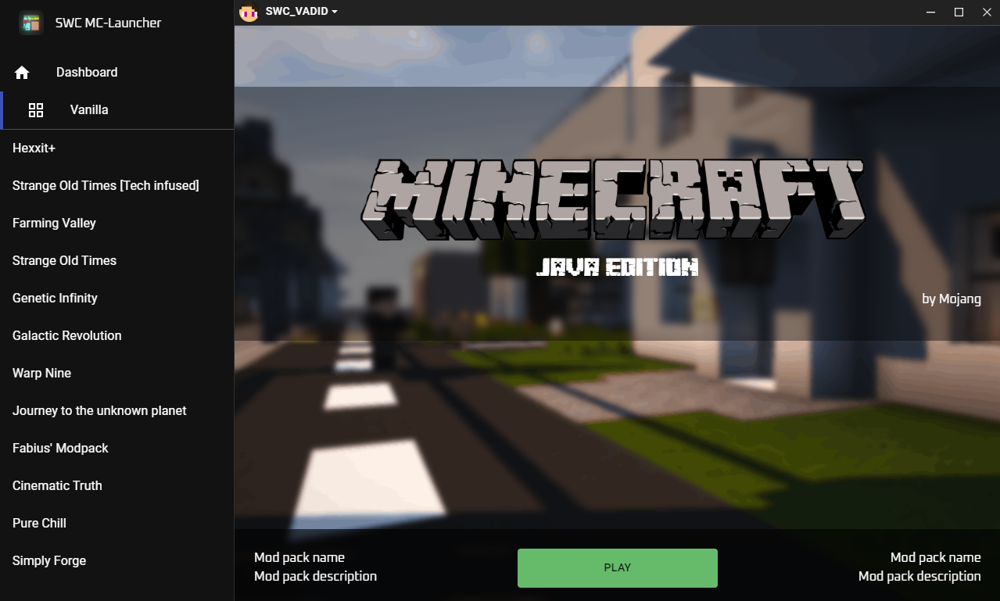

# Software City's Modded-Minecraft Launcher

> Developed by [Davis_Software](https://github.com/Davis-Software) &copy; 2022

> The Recode: Now with a new awesome looking UI and microsoft account support!

# Image Preview

# Features
- coming soon

# Installation
* Download an installer
    * Go to the [releases](https://github.com/Davis-Software/swc_mclauncher/releases) page and download an installer compatible with your OS
* Compile yourself:
    * Clone the repository `git clone https://github.com/Davis-Software/swc_mclauncher.git`
    * Enter directory `cd swc_mclauncher-master`
    * Install required packages `npm install` and `npm install --save-dev`
    * Install required packages for the react frontend `cd front_src`, `npm install` and `npm install --save-dev`
    * Compile the frontend `npm run build`
    * Go back to the root directory `cd ..`
    * Run the application to check if it's working `npm start`
    * Compile the application into an installer `npm run dist` (for win64)
    * Consult `package.json` and `front_src/package.json` for more commands & info
